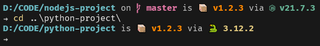

# Powershell Prompt

[English](./README.md) | 简体中文

使用几个 ps1 脚本将你的 [Windows Powershell](https://github.com/PowerShell/PowerShell)的提示符更改为 [Starship](https://github.com/starship/starship)风格！



## 安装

1. 将此存储库克隆到本地计算机。

2. 打开你的`Powershell`配置文件。你可以通过在`Powershell`终端中运行以下命令来执行此操作。

```powershell
notepad $PROFILE
```

3. 将下面一行代码添加到你的配置文件中：

```powershell
Import-Module <path-to-repository>\Prompt.psm1
```

## 特性

+ 显示当前项目的 Git 分支和状态。
+ 显示当前项目的包版本。
+ 显示当前项目的环境及其版本。

## 为什么？

+ 无需安装任何其他软件
+ 代码全部由`Powershell`脚本编写，简单易懂，方便修改
+ 未用到任何`Powershell`以外的运行时
